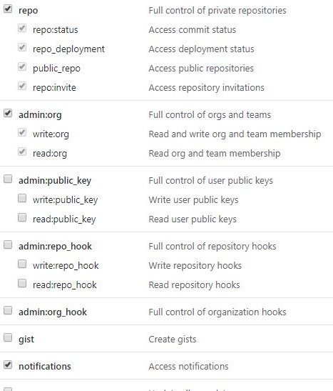

## 🍄️ / Example-01

👉🏻 Installing

1. Clone this repository using `git clone`.
2. Onto the repository, install the dependecies using `yarn install` or `npm install`

```
yarn install
yarn start
```

👉🏻 Configuration

**You need to have a Github token.**

1. Go to [https://github.com/settings/tokens](https://github.com/settings/tokens) and create a new token.

2. Select this options:



3. Rename the file: `.env.example` to `.env`

4. In the `.env` add your token